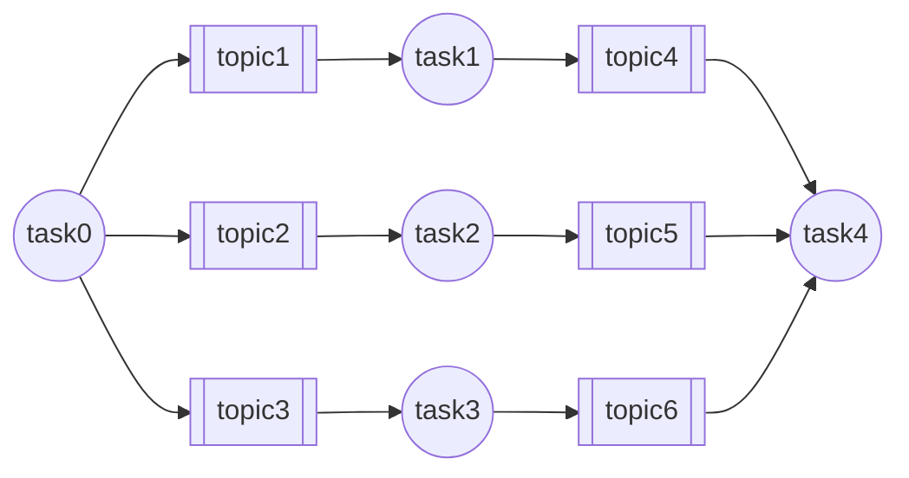
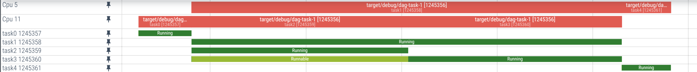

# DAG Task 0

```mermaid
graph LR
	task0((task0)) --> topic1[[topic1]]
	task0((task0)) --> topic2[[topic2]]
	task0((task0)) --> topic3[[topic3]]
	topic1 --> task1((task1))
	topic2 --> task2((task2))
	topic3 --> task3((task3))
	task1 --> topic4[[topic4]]
	task2 --> topic5[[topic5]]
	task3 --> topic6[[topic6]]
	topic4 --> task4((task4))
	topic5 --> task4((task4))
	topic6 --> task4((task4))
```

| task | weight | HELT rank |
|-|-|-|
| task0 | 100 | 600 |
| task1 | 400 | 500 |
| task2 | 200 | 300 |
| task3 | 200 | 300 |
| task4 | 100 | 100 |

