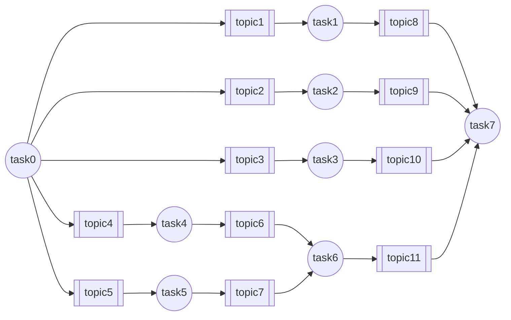
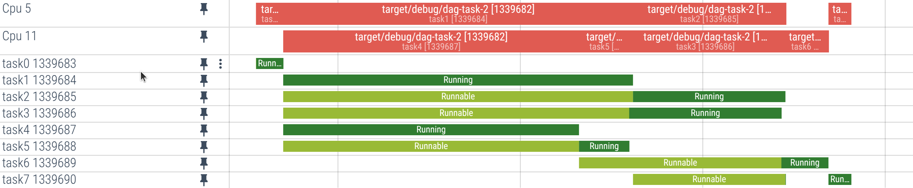

# DAG Task 2

| task | weight | HELT rank |
|-|-|-|
| task0 | 100 | 1000 |
| task1 | 700 |  800 |
| task2 | 300 |  400 |
| task3 | 300 |  400 |
| task4 | 600 |  900 |
| task5 | 100 |  400 |
| task6 | 200 |  300 |
| task7 | 100 |  100 |

