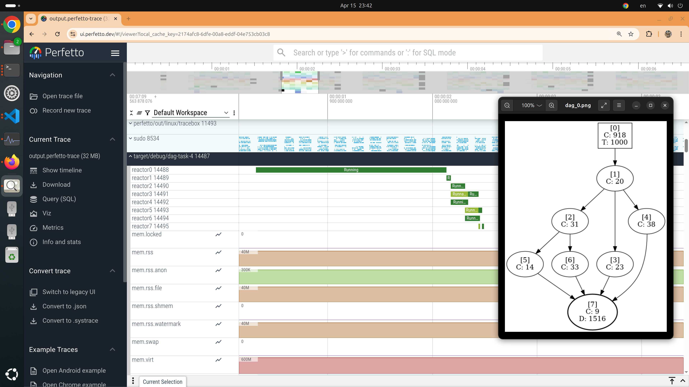
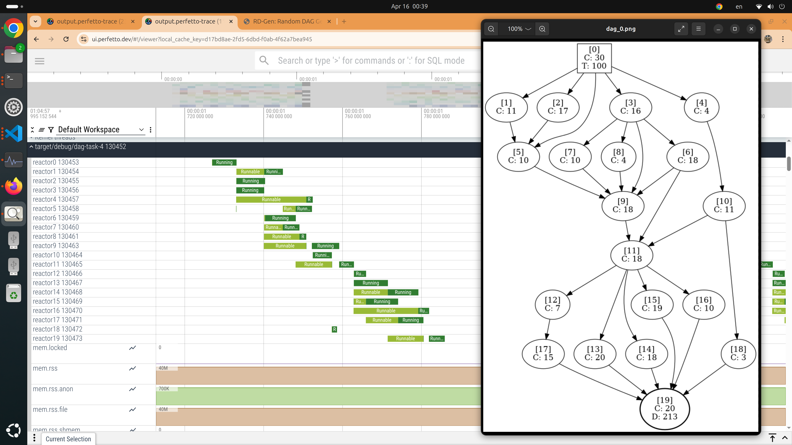
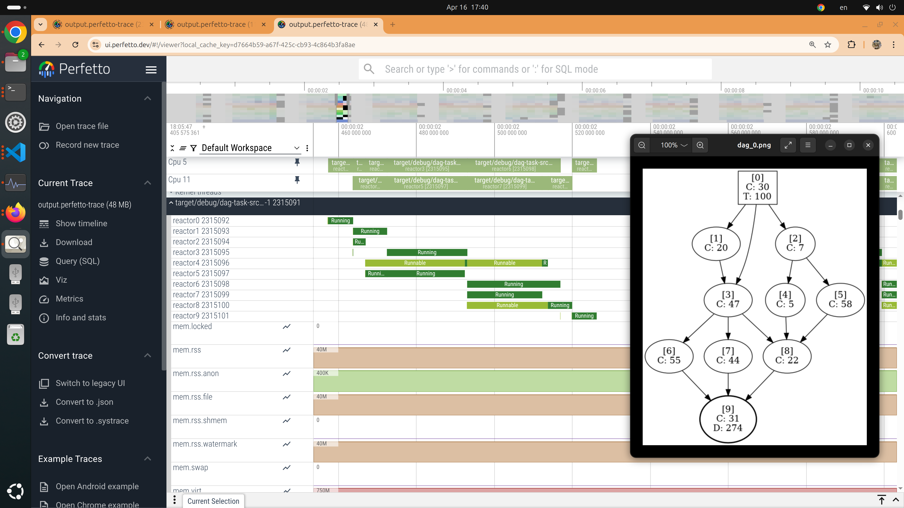

# Dag-task-src-1-sink-1

A DAG task application with exactly one source node and one sink node, whose structure is generated by the RD-Gen tool.

## What is RD-Gen?

RD-Gen is a novel tool for generating DAG structures.
It allows you to automatically generate various DAG structures by simply specifying a few properties of a DAG task.

- 🔗 [GitHub Repository](https://github.com/azu-lab/RD-Gen)  
- 📄 [Research Paper](https://ieeexplore.ieee.org/document/10197013)

## How to use

This application executes a DAG task defined in a YAML file generated by RD-Gen.

### Example

```
$ cargo build
$ sudo target/debug/dag-task-src-1-sink-1 --dag-file ~/RD-Gen/DAGs/DAGs/dag_0.yaml
```

NOTE: When you generate DAGs using RD-Gen, make sure to set both the number of source nodes and the number of sink nodes to 1.

## The command line arguments

```
$ sudo target/debug/dag-task-src-1-sink-1 --help
Usage: dag-task-src-1-sink-1 [OPTIONS] --dag-file <DAG_FILE>

Options:
  -d, --dag-file <DAG_FILE>    Specify the YAML file created by RD-Gen, which represents a DAG structure.
  -b, --busy-unit <BUSY_UNIT>  Specify the unit of work. [default: 40000]
  -h, --help                   Print help
```

## How it works

To realize the DAG task, we create a topic for each link.
For example, if there is a link `i` from node `a` to node `b`, we create a topic named `"topic{i}"`, where:

- Node `a` is registered as the publisher
- Node `b` is registered as the subscriber

In total, There are as many topics as there are links.

## Experiments

### 1



### 2



### 3


